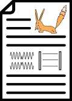

# `renard-spec` - Open Sigfox Protocol Specifications

`renard-spec` is a document describing the details of the Sigfox radio protocol's uplink and downlink written in LaTeX.
These details are either based on publicly available information or on observations of Sigfox radio traffic.
The authors of `renard-spec` are not affiliated with Sigfox in any way.
It explains the inner workings of the reference implementations [`librenard`](https://github.com/Jeija/librenard), [`renard`](https://github.com/Jeija/renard) and [`renard-phy`](https://github.com/Jeija/renard-phy) on a more abstract level.

You can **download the compiled PDF document [from this repository's "releases" section](https://github.com/Jeija/renard-spec/releases)**.
